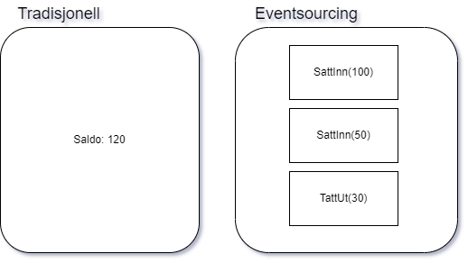

# eventsourcing-fagdag

Her finnes kode og ressurser for fagdag med tema eventsourcing.
## Eventsourcing i et nøtteskall
Eventsourcing er en måte å bygge datasystem på hvor man lagrer hendelser i sekvens i stedet for normalisert datamodell. La oss gå rett på det klassiske bankkonto eksempelet:

Ved tradisjonell systemutvikling vil man lagre en konto med en saldo. Slik at hvis man åpner en konto og setter inn 100 kr og deretter 50 kroner, så lagres det 150 kr i feltet saldo.

Ved eventsourcing lagrer man de to hendelsene SattInn(100) og SattInn(50). Der eksisterer ikke noe saldofelt i master dataene. Hvis man vil uttrykke saldo, så er det ikke et felt, men en beregning ut i fra hendelsene: 100 kr + 50 kr = 150 kr.

Vi kan fortsette eksempelet med at man deretter tar ut 30 kr. Da vil den tradisjonelle metoden endre feltet saldo til 120 kr.

I Eventsourcing legger man kun til en ny hendelse TattUt(30). Ingen saldo. Dersom man trenger saldo må man beregne den: 100 kr + 50 kr - 30 kr = 120 kr.

## Men dette ser jo helt sløkket ut?
Ved første øyekast ser Evensourcing upraktisk ut å jobbe med. Og det er korrekt! Derfor bygger vi ting og tang rundt for å gjøre det lett å jobbe med.

Oppå Evensourcingen lager man normaliserte entiteter som representerer for eksempel en konto med en saldo. Så har vi en load metode som leser dataene opp fra eventsourcingen og over i de gjenkjennbare "normale" entitetene. Saldo vil da bli beregnet og satt i saldo feltet.

Men vil ikke det fort bli et ytelsesproblem, at mange hendelser må spoles igjennom og beregnes hver gang man leser? Jo, det kan det. Da kan man benytte en mekanisme som kalles snapshot som gjør at vi bare trenger beregne hendelsene etter forrige snapshot.

Et annet ytelsesproblem er at det kan bli "trangt" å skrive og lese til eventstore da all IO i hele systemet skal inn og ut av en tabell (relasjonsdatabase) eller collection (dokumentdatabase). Dette kan kompenseres med noe som kalles projections og et pattern som heter CQRS (Command Query Responsibility Segregation). Da deler man skriv og les i to forskjellige systemer slik at eventstore i all hovedsak er kun input.

## Og hva er så poenget?
Eventsourcing og Event drevne systemer har noen styrker og egenskaper som gjør dem egnet til en del type systemer.
- Eventsourcing er det jeg kaller lossless lagring av data.  Du lagrer ikke bare siste tilstand, men du lagrer både data og kontekst i tid og rom. Dette gir et enormt bra datagrunnlag for rapportering,dataanalyse, bigdata og lignende. Du kan gå tilbake i tid og få nye rapporter og perspektiver ved å spille av alle hendelsene slik de skjedde i den virkelige verden.  I et tradisjonelt system må denslags lages til i tillegg. Større virksomheter har typisk egne systemer som ser på trafikk og samler data i spesialistsystemer. Eller bygger egne logger (for kontoen vår en transaksjonslogg) og ting og tang rundt de tradisjonelle entitetene.  Og det går jo det og, men det er ofte ufattelig mye styr med de tingene der. Dette er implisitt med på kjøpet i et eventsourcing system.  Og i dagens verden er data mye verdt, så systemer med lossless lagring passer bra i tiden.
- Audit logging.  Du får en uovertruffen audit log over hva som skjedde når av hvem. Spesielt for systemer hvor juss er involvert (eks banker) kan dette gi en fin merverdi, og uten at du trenger lage til noe ekstra.
- Ingen databasemodellering.  Hele modellen din er en tabell hvor alt lagres i sekvens nedover i en evig lang rekke.  Om dette er en fordel eller ulempe spørs hvem du spør, men man sparer i hvert fall tid og krefter som kan benyttes til å bygge tingene som må til i kodeverden.
- Løse koblinger.  I Eventdrevne systemer er det mer naturlig og lettere å få til reelt løse koblinger mellom komponenter (påstand).
- Seperation Of Concerns. Henger sammen med løse koblinger. Du har ansvar for å publisere et event, og du trenger ikke bry deg med om 0, 5 eller 10 konsumenter plukker ned eventet ditt eller hva de bruker det til.  
- Ytelse.  Nå har vi jo lenger oppe etablert at et eventsourcing system fort kan få problemer med ytelse over tid. Men hvis man benytter mekanismene med snapshots og CQRS med flere, kan denne typen systemer yte svært god ytelse.
- Sanntidssystemer. Event drevne systemer egner seg godt til sanntidssystemer med dashboards og sånt, f.eks. IOT systemer.
## Høres fett ut. Men det må da være ulemper?
- Programmerere flest kan det ikke og skjønner det ikke. Det er en lærekurve, og det tar tid å tenke om det man er vant med. Så kompetanse og forståelse er en av de største ulempene etter mitt syn.
- Det må jobbes en stund med grunnmur før man kan bygge huset. Det er en mer komplisert og diffus kodebase å forholde seg til når man bygger. Så hvis ikke man har peiling og skal slenge opp en rask POC, så kan svetteringene under armene bli store.
- Evensourcing har utfordringer hvis det er hyppige og store omveltninger i den grunnleggende event/forretningsstrukturen.  Så ville ikke valgt dette for diffuse systemer som man ikke helt vet hva retning kommer til å gå i.  Husk at alle eventer må kunne spilles av siden tidenes morgen. Så et event må versjoneres. Og hvis der kommer breaking changes i nye versjoner, må man finne en måte å gjøre de tidligere versjonene kompatible.  Enten med on the fly data transformeringer eller med en engangs konvertering av f.eks V1 eventene til V2.
- Det passer normalt ikke til å bygge hele virksomheten inn i et altomfattende eventsourcing system. Man vil typisk ha HR, CRM, 3. parts systemer og gammel morro å forholde seg til.  Men evensourcing kan fungere strålende i en moderne sysrtemarkitektur med API'er, eventer og denslags. Da kan evensourcing benyttes som en implementasjonsdetalj for eet delsystem bak API'er og event busser. De trenger ikke vite noe om eventsourcing for å benytte det.

## Kodeløsning
I dette repository følger det med kodeeksempel på implementasjon av eventsourcing i C# og .NET.  Der er implementert to forskjellige varianter med to forskjellige løsningspatterns (CDE og Outbox) mot to forskjellige databaseteknologier:  Microsoft Azure Cosmos Db og MongoDB.

Koden er skrevet i hovedsak etter Clean Architecture prinsipper, eller Onion arkitektur om du vil.  Har ikke noe direkte med eventsourcing å gjøre, men det er slik jeg liker å ha det :)  Og det er også en bra måte (påstand)!

Måten jeg har bygget entiteten(e) på er sterkt inspirert av DDD (Domain Driven Design). Dette betyr at entiteten ikke bare har data med også oppførsel.  Jeg har nok ikke vært DDD purist, så der vil nok være ting å sette fingeren på når det gjelder innkapsling, egne klasser for alle id'er og lister osv.
### Utviklingsmiljø
Jeg har laget koden med de verktøy jeg er mest vant med for tiden, så beklager hvis det ikke passer hatten din :).  Og dobbelt beklager for ikke å ha laget Relasjonsdatabase versjon...)

Github repository: [https://github.com/Sonat-Consulting/eventsourcing-fagdag](https://github.com/Sonat-Consulting/eventsourcing-fagdag)

#### For å komme igang:

1. Installer [Cosmos DB local emulator](https://learn.microsoft.com/en-us/azure/cosmos-db/local-emulator?tabs=ssl-netstd21)
2. Installer [.NET 6.0](https://dotnet.microsoft.com/en-us/download)
3. Ta i bruk din favoritt IDE for C# prosjekter eller last ned [JetBrains Rider](https://www.jetbrains.com/rider/download) eller [Visual Studio 2022 Community](https://visualstudio.microsoft.com/vs/).
4. Cosmos DB local Emulator må kjøre på maskinen din, så start den. Den har en Data Explorer på Url https://localhost:8081/_explorer/index.html
5. Åpne og kjør prosjektet [Clippers.EventFlow](https://github.com/Sonat-Consulting/eventsourcing-fagdag/blob/main/final/Clippers.EventFlow/src/Clippers.EventFlow.sln). Dette er Eventsourcing løsningen.
6. For projeksjoner, åpne og kjør prosjektet [Clippers.EventFlow.Projections](https://github.com/Sonat-Consulting/eventsourcing-fagdag/blob/main/final/Clippers.EventFlow.Projections/src/Clippers.EventFlow.Projections.sln).
7. For GUI, åpne og kjør prosjektet [clippers-svelte-gui](https://github.com/Sonat-Consulting/eventsourcing-fagdag/tree/main/svelte-demo-app) ved å kjøre `npm install` og `npm run dev`.
8. I tillegg er der et prosjekt (Clippers.FlowGenerator)(https://github.com/Sonat-Consulting/eventsourcing-fagdag/blob/main/Clippers.FlowGenerator/Clippers.FlowGenerator.sln) som simulerer trafikk inn på Eventsourcingen ved å lage, starte og avslutte klipper jevnt og trutt

## Clippers
Casen som er brukt i koden, er en fiktiv frisøkjede.

Clippers er en frisørkjede med sterk digital fokus. All bestilling, betaling og øvrig administrasjon skjer digitalt i App og på web. Frisørene derimot; de er fremdeles analoge.

Vi skal bygge en bit av et køsystem med evensourcing og projeksjoner.

En kunde kjøper en klipp. De (eller klippen) skal da havne i køen som "waiting".  Når det er deres tur, havner de i stolen som "serving". Og når de er ferdig klippet, blir de "completed".

Når de er i "waiting" status, men ikke gidder vente mer, kan de kansellere og blir "cancelled". 

En hårklipp har da følgende inputs:

- HaircutCreated (waiting)
- HaircutStarted (serving)
- HaircutCompleted (completed)
- HaircutCancelled (cancelled)

(To be continued....)

